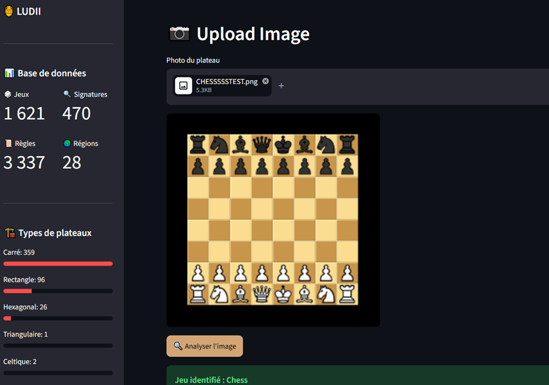
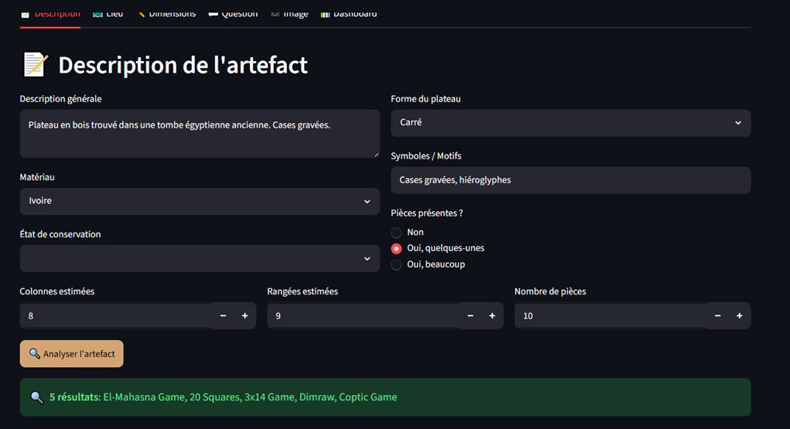
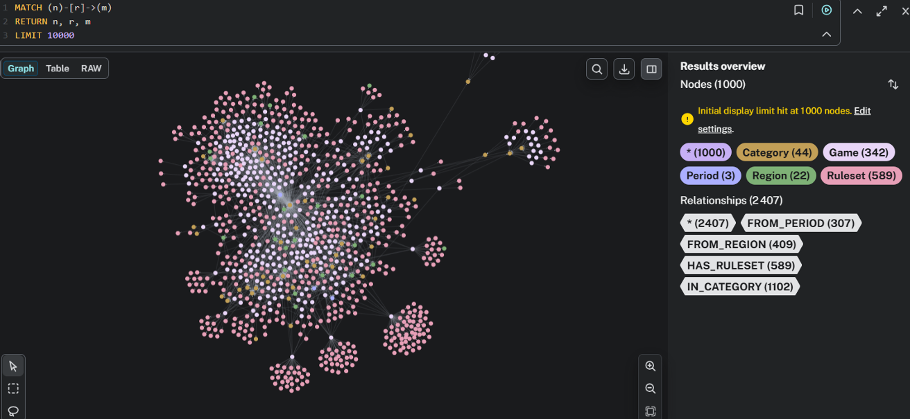

# LUDII Game Intelligence
### Intelligence artificielle pour l'archéologie ludique

<p align="center">
  
  
  
  
  
</p>

---

## Présentation

**LUDII Game Intelligence** est une plateforme d'intelligence artificielle pour l'**identification**, l'**analyse historique** et la **reconstruction** de jeux de table anciens à partir d'artefacts (plateaux fragmentaires, pièces isolées, photographies). Le système combine quatre piliers : la vision par ordinateur (YOLOv8), un graphe de connaissances (Neo4j), un module de question-réponse (RAG + modèle de langage) et la reconstruction 3D (Trimesh). Il s'appuie sur la base de données Ludii (1 621 jeux, 3 337 règles, ≈ 16 739 relations).

---

## Captures d'écran

**Identification par image** — l'utilisateur téléverse une photo de plateau ; YOLOv8 détecte les pièces et le graphe identifie le jeu.



**Description de l'artefact** — identification multi-critères à partir d'une description, de la forme du plateau et des dimensions estimées (tolérante aux artefacts incomplets).



**Graphe de connaissances (Neo4j)** — nœuds `Game`, `Ruleset`, `Region`, `Period`, `Category` reliés par leurs relations typées.



---

## Fonctionnalités

- Analyse d'image : détection des pièces (YOLO) puis identification via le graphe
- Description libre : recherche sémantique à partir du texte de l'artefact
- Lieu de fouille : jeux culturellement proches par région et période
- Dimensions partielles : identification tolérante pour plateaux endommagés
- Reconstruction 3D : modèle GLB interactif du plateau
- Question/réponse : réponses en langage naturel ancrées dans le graphe
- Jeux similaires : traversée du graphe par région, période, catégorie
- Tableau de bord : KPIs et statistiques du corpus

---

## Stack technique

| Composant | Technologie |
|-----------|-------------|
| Base de connaissances | Neo4j 5.x (Cypher) |
| API REST | FastAPI |
| Détection visuelle | YOLOv8 (Ultralytics) |
| Modèle de langage | configurable (RAG) |
| Embeddings | all-MiniLM-L6-v2 (Sentence Transformers) |
| Orchestration | n8n (Docker) |
| Interface | Streamlit + Plotly |
| Reconstruction 3D | Trimesh (GLB) |
| Runtime | Python 3.11 |

---

## Structure du projet

```
ludii-game-intelligence/
├── phase1_rag/            # RAG hybride (embeddings + LLM + fallback Neo4j)
├── phase2_vision/         # Vision : detection + reconstruction 3D + modeles
├── phase3_api/            # API FastAPI (main, schemas, routes/)
├── phase4_neo4j/          # Pipeline Neo4j (import + signatures + cypher/)
├── phase5_n8n/            # Workflow d'orchestration n8n
├── phase6_advanced/       # Fonctionnalites avancees
├── app.py                 # Interface Streamlit
├── models/                # embeddings.npy, node_mapping.json
├── screenshots/           # Captures d'ecran (README)
├── requirements.txt
├── Dockerfile
├── docker-compose.yml
└── .env.example
```

---

## Installation

### Prérequis
Python 3.11, Java 17, Neo4j 5.x, Docker, Git.

```bash
git clone https://github.com/Sabbarso/ludii-game-intelligence.git
cd ludii-game-intelligence

python -m venv venv
venv\Scripts\activate          # Windows  (source venv/bin/activate sur Linux/Mac)
pip install -r requirements.txt

cp .env.example .env           # puis renseigner Neo4j et la cle du modele de langage
docker-compose up -d
```

### Variables d'environnement (`.env`)

```env
NEO4J_URI=bolt://localhost:7687
NEO4J_USER=neo4j
NEO4J_PASSWORD=votre_mot_de_passe
LLM_API_KEY=votre_cle_api
```

### Lancement

```bash
uvicorn phase3_api.main:app --reload     # API   -> http://localhost:8000/docs
streamlit run app.py                     # UI    -> http://localhost:8501
```

---

## Auteurs

Projet de fin d'année — ENSIAS, Data & Software Science (2025–2026)
Soukaina Sabbar · Salma Issam — Encadrant : Pr. Khalid Nafil

## Licence

Distribué sous licence MIT.